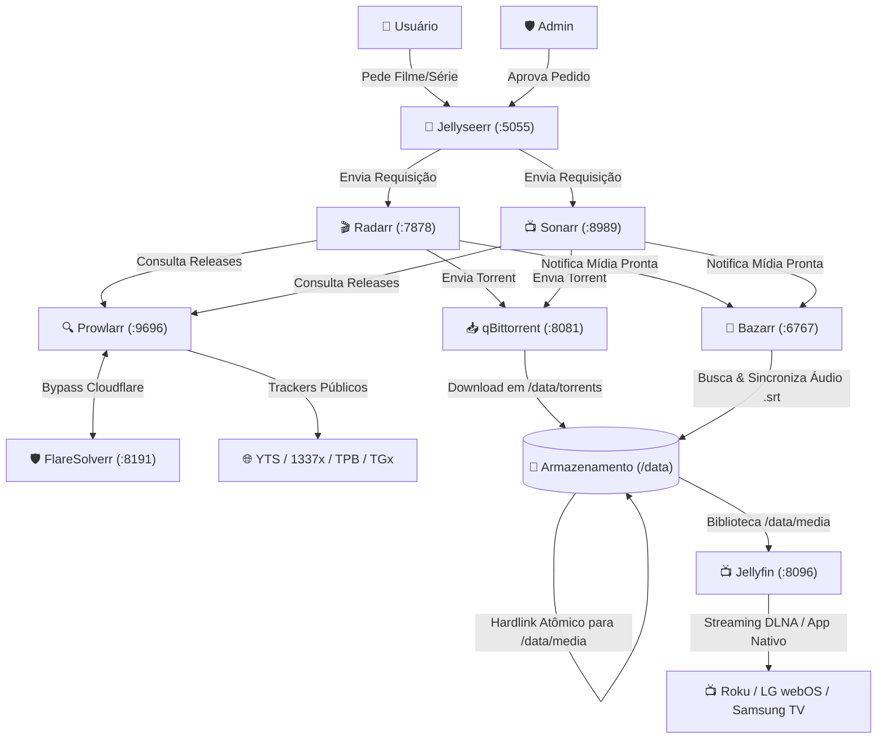

# 🍿 SimpleArrMedia — Home Media Server & *arr Automation Stack

O jeito simples, limpo e descomplicado de subir um servidor de mídia doméstico autônomo com Jellyfin, qBittorrent e a stack *arr completa (Radarr, Sonarr, Prowlarr, Bazarr, FlareSolverr e Jellyseerr) com assistente de configuração em 1 clique e Hardlinks atômicos (TRaSH Guides).

---

## 🏗️ Arquitetura e Serviços

O ambiente roda inteiramente via **Docker Compose** utilizando a Docker Engine nativa do Linux, garantindo acesso direto aos discos e aceleração por hardware da GPU Intel (`/dev/dri`).



---

## 🌐 Portas e URLs de Acesso

Substitua `<IP_DO_SERVIDOR>` pelo IP local da sua máquina (ex: `192.168.1.100`) ou utilize `localhost`:

| Serviço | URL Local | Descrição |
| :--- | :--- | :--- |
| **SimpleArr Hub** | `http://<IP_DO_SERVIDOR>:5000` | Central de Automação & 1-Click Setup Wizard |
| **Jellyseerr** | `http://<IP_DO_SERVIDOR>:5055` | Catálogo visual para solicitação de conteúdos |
| **Jellyfin** | `http://<IP_DO_SERVIDOR>:8096` | Servidor de streaming e transcodificação |
| **qBittorrent** | `http://<IP_DO_SERVIDOR>:8081` | Gerenciador de downloads de torrents |
| **Radarr** | `http://<IP_DO_SERVIDOR>:7878` | Gerenciador e catalogador de filmes |
| **Sonarr** | `http://<IP_DO_SERVIDOR>:8989` | Gerenciador e catalogador de séries |
| **Prowlarr** | `http://<IP_DO_SERVIDOR>:9696` | Gerenciador central de indexadores e trackers |
| **FlareSolverr** | `http://<IP_DO_SERVIDOR>:8191` | Proxy de resolução de desafios Cloudflare |
| **Bazarr** | `http://<IP_DO_SERVIDOR>:6767` | Download e sincronizador de legendas |

---

## 📁 Estrutura de Diretórios (Padrão TRaSH Guides)

Seguindo as melhores práticas do [TRaSH Guides](https://trash-guides.info/), todas as pastas de torrents e mídia compartilham o mesmo volume raiz (`/data`), permitindo **Hardlinks Atômicos** (o arquivo é movido instantaneamente sem cópia de disco e sem duplicar o espaço ocupado).

```text
<DATA_DIR>/                          <- Definido no .env (Mapeado como /data nos containers)
├── torrents/                        <- Downloads do qBittorrent
│   ├── movies/
│   └── tv/
└── media/                           <- Pastas finais lidas pelo Jellyfin
    ├── movies/                      <- Filmes organizados pelo Radarr
    └── tv/                          <- Séries organizadas pelo Sonarr (por temporada)
```

E a estrutura do repositório:

```text
./
├── docker-compose.yml
├── .env.example
├── README.md
├── LICENSE
├── hub/                             <- Central AutoArr Hub & Wizard WebUI
├── docs/
│   ├── ARCHITECTURE.md
│   ├── SETUP_GUIDE.md
│   └── MAINTENANCE.md
└── config/                          <- Configurações dos containers (criado no primeiro boot)
    ├── jellyfin/
    ├── qbittorrent/
    ├── radarr/
    ├── sonarr/
    ├── prowlarr/
    ├── bazarr/
    └── jellyseerr/
```

---

## 🚀 Como Iniciar (Quickstart)

1. Clone o repositório:
```bash
git clone https://github.com/rogerioc/simple-arr-media.git
cd simple-arr-media
```

2. Crie seu arquivo de ambiente a partir do exemplo:
```bash
cp .env.example .env
```
*Edite o `.env` definindo o seu `DATA_DIR` e o `TZ` desejado.*

3. Inicie os containers:
```bash
docker compose up -d
```

4. Acesse o **SimpleArr Hub** em `http://localhost:5000` (ou `http://<IP_DO_SERVIDOR>:5000`) e clique em **Executar Auto-Setup Padrão**!

---

## 🛠️ Comandos de Operação

### Atualizar ou reiniciar serviços:
```bash
docker compose up -d
```

### Parar todos os serviços:
```bash
docker compose down
```

### Ver status dos containers:
```bash
docker --context default ps
```

### Ver logs em tempo real:
```bash
docker --context default compose logs -f [nome_do_servico]
```

---

## 📚 Documentação Detalhada

* [Arquitetura & Hardlinks](docs/ARCHITECTURE.md)
* [Guia de Configuração e Integrações](docs/SETUP_GUIDE.md)
* [Manutenção, Backups e Troubleshooting](docs/MAINTENANCE.md)
