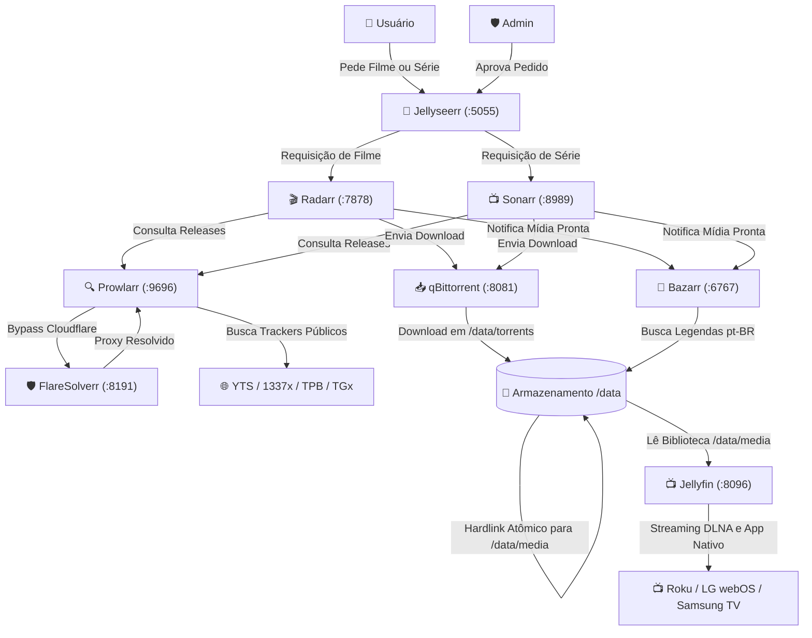
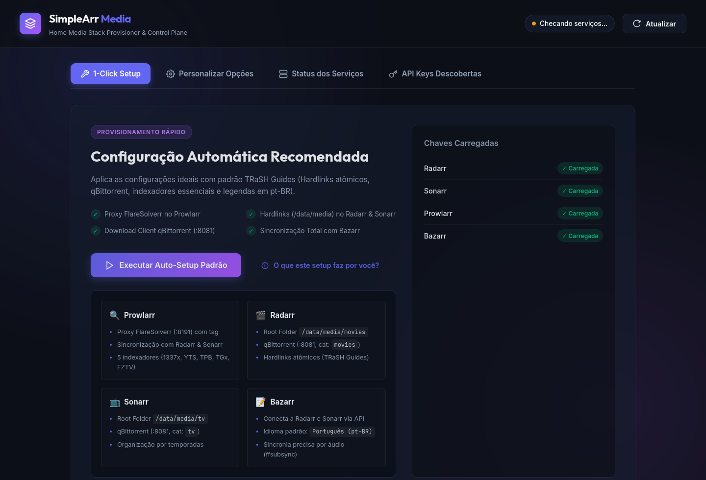
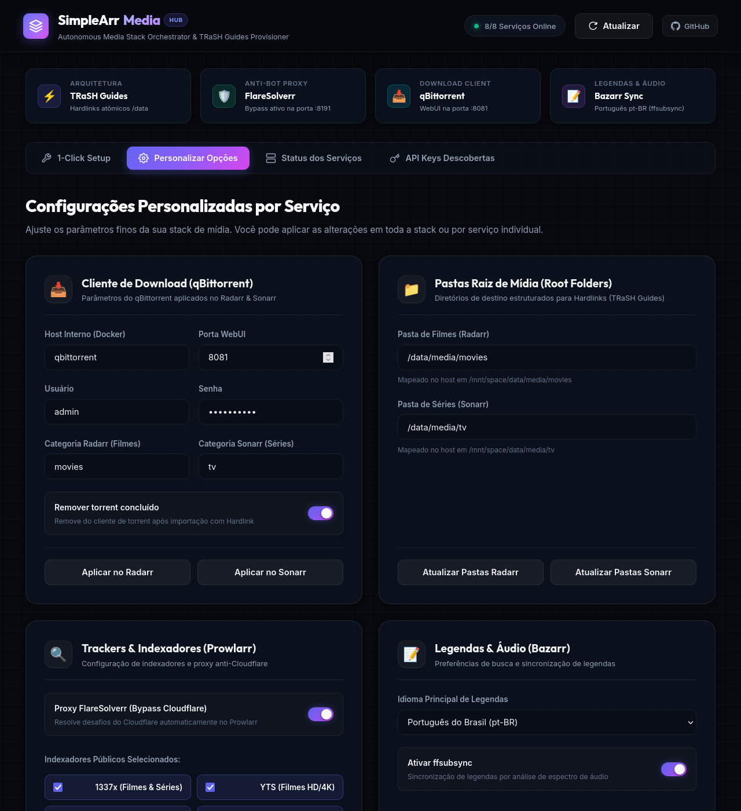
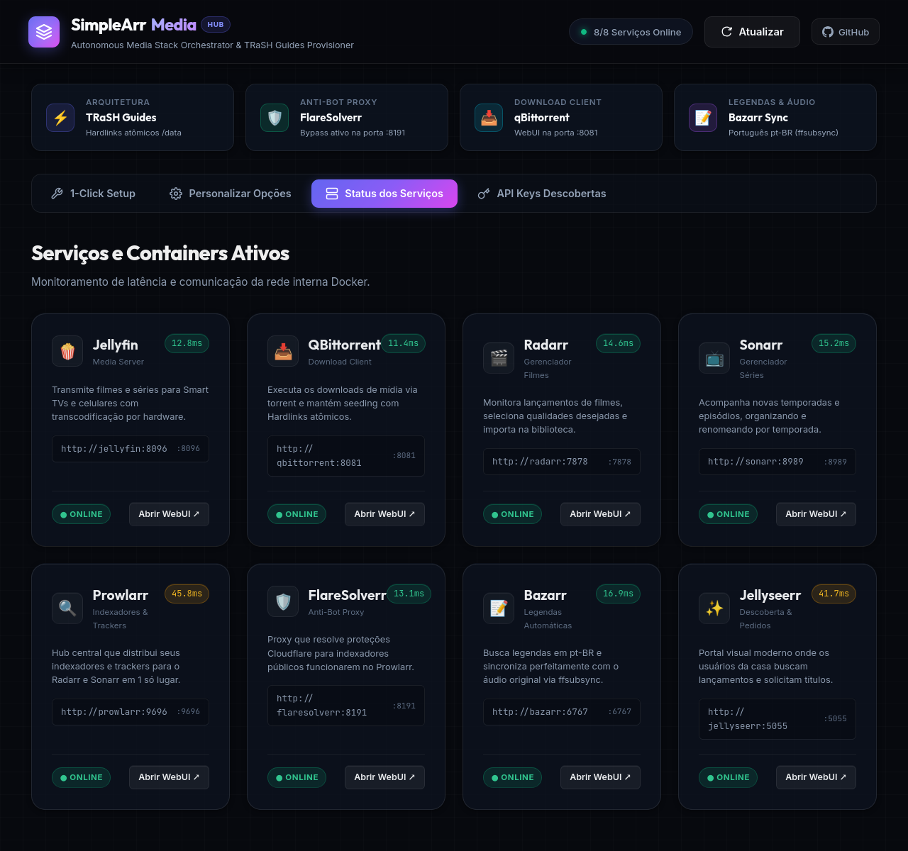
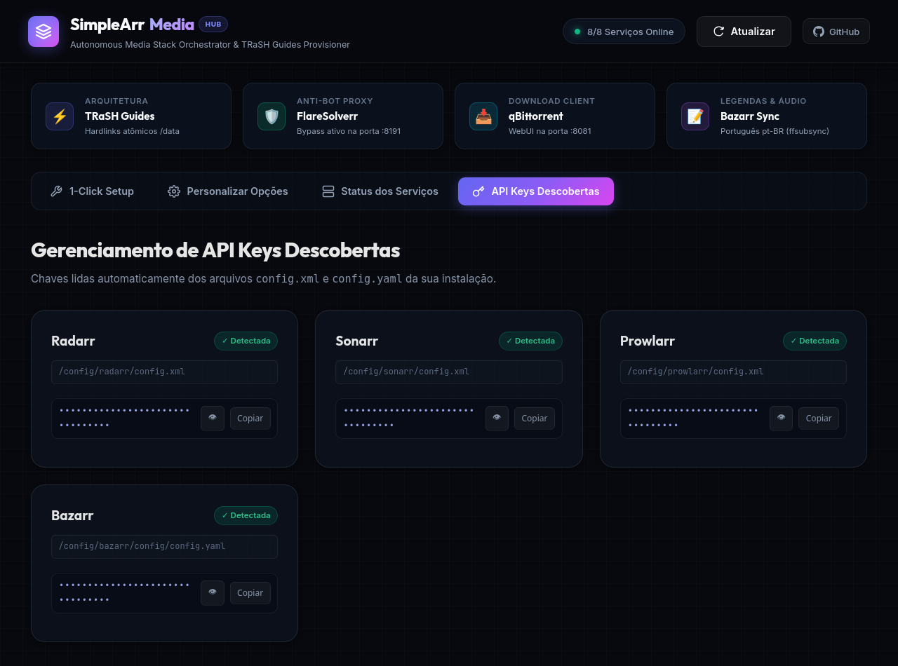

# 🍿 SimpleArrMedia — Home Media Server & *arr Automation Stack

[](https://www.docker.com/)
[](https://deepmind.google)
[](https://deepmind.google)
[](LICENSE)

O jeito simples, limpo e descomplicado de subir um servidor de mídia doméstico autônomo com Jellyfin, qBittorrent e a stack *arr completa (Radarr, Sonarr, Prowlarr, Bazarr, FlareSolverr e Jellyseerr) com assistente de configuração em 1 clique e Hardlinks atômicos (TRaSH Guides).

---

## 🏗️ Arquitetura e Serviços

O ambiente roda inteiramente via **Docker Compose** utilizando a Docker Engine nativa do Linux, garantindo acesso direto aos discos e aceleração por hardware da GPU Intel (`/dev/dri`).



---

## 📸 Demonstração da Interface (SimpleArr Hub)

O projeto inclui uma interface de controle própria rodando na porta `5000` para orquestrar e validar toda a stack:

### 1. Setup Automático em 1 Clique (Zero-Touch)
> *Lê automaticamente as chaves do host, conecta os serviços e provisiona caminhos, qBittorrent e indexadores:*



### 2. Configurações Personalizadas por Serviço
> *Permite editar clientes de download, pastas de filmes/séries, idioma de legendas e selecionar trackers públicos individualmente:*



### 3. Diagnóstico e Status em Tempo Real
> *Monitoramento contínuo de latência, saúde dos containers e conectividade da rede interna Docker:*



### 4. Descoberta Automática de API Keys
> *Detecta, mascara e permite copiar com segurança as chaves de API geradas pelos containers:*



## 🧭 Papel e Responsabilidade de Cada Serviço

Para quem está começando no ecossistema *arr, a divisão modular de responsabilidades é o segredo para uma stack estável e autônoma:

| Serviço | Porta | Papel Principal | O que ele faz & Por que existe |
| :--- | :--- | :--- | :--- |
| **SimpleArr Hub** | 🚀 `:5000` | **Orquestrador Central** | Automação e setup em 1 clique. Descobre API keys, testa a rede e aplica as regras do TRaSH Guides automaticamente. |
| **[Jellyseerr](https://github.com/Fallenbagel/jellyseerr)** | ✨ `:5055` | **Vitrine de Descobertas** | Portal visual moderno estilo Netflix para a família buscar lançamentos e solicitar filmes/séries em 1 clique. |
| **[Radarr](https://radarr.video/)** | 🎬 `:7878` | **Gerenciador de Filmes** | Monitora lançamentos de filmes, escolhe qualidades (1080p/4K), envia para download e organiza `/data/media/movies`. |
| **[Sonarr](https://sonarr.tv/)** | 📺 `:8989` | **Gerenciador de Séries** | Monitora temporadas e episódios semanais, renomeia arquivos e organiza pastas por temporada em `/data/media/tv`. |
| **[Prowlarr](https://prowlarr.com/)** | 🔍 `:9696` | **Hub de Indexadores & Trackers** | Cadastro central de sites de torrent (1337x, YTS, TPB, etc.). Sincroniza automaticamente com Radarr e Sonarr em 1 só lugar. |
| **[FlareSolverr](https://github.com/FlareSolverr/FlareSolverr)** | 🛡️ `:8191` | **Bypass Anti-Bot / Cloudflare** | Atua como proxy inteligente para responder a desafios Cloudflare de sites públicos sem que os trackers quebrem. |
| **[qBittorrent](https://www.qbittorrent.org/)** | 📥 `:8081` | **Motor de Downloads** | Baixa os arquivos via torrent com alta performance e gerencia categorias (`movies`, `tv`) com seeding contínuo. |
| **[Bazarr](https://www.bazarr.media/)** | 📝 `:6767` | **Legendas Automáticas** | Varre a biblioteca buscando legendas em pt-BR e sincroniza perfeitamente pelo áudio original do vídeo (`ffsubsync`). |
| **[Jellyfin](https://jellyfin.org/)** | 🍿 `:8096` | **Servidor de Streaming** | O "Netflix próprio": organiza pôsteres, metadados e faz transcodificação por hardware (Intel QSV) para Smart TVs e celulares. |

---

## 🌐 Portas e URLs de Acesso

Substitua `<IP_DO_SERVIDOR>` pelo IP local da sua máquina (ex: `192.168.1.100`) ou utilize `localhost`:

| Serviço | URL Local | Descrição |
| :--- | :--- | :--- |
| **SimpleArr Hub** | `http://<IP_DO_SERVIDOR>:5000` | Central de Automação & 1-Click Setup Wizard |
| **Jellyseerr** | `http://<IP_DO_SERVIDOR>:5055` | Catálogo visual para solicitação de conteúdos |
| **Jellyfin** | `http://<IP_DO_SERVIDOR>:8096` | Servidor de streaming e transcodificação |
| **qBittorrent** | `http://<IP_DO_SERVIDOR>:8081` | Gerenciador de downloads de torrents |
| **Radarr** | `http://<IP_DO_SERVIDOR>:7878` | Gerenciador e catalogador de filmes |
| **Sonarr** | `http://<IP_DO_SERVIDOR>:8989` | Gerenciador e catalogador de séries |
| **Prowlarr** | `http://<IP_DO_SERVIDOR>:9696` | Gerenciador central de indexadores e trackers |
| **FlareSolverr** | `http://<IP_DO_SERVIDOR>:8191` | Proxy de resolução de desafios Cloudflare |
| **Bazarr** | `http://<IP_DO_SERVIDOR>:6767` | Download e sincronizador de legendas |

---

## 📁 Estrutura de Diretórios (Padrão TRaSH Guides)

Seguindo as melhores práticas do [TRaSH Guides](https://trash-guides.info/), todas as pastas de torrents e mídia compartilham o mesmo volume raiz (`/data`), permitindo **Hardlinks Atômicos** (o arquivo é movido instantaneamente sem cópia de disco e sem duplicar o espaço ocupado).

```text
<DATA_DIR>/                          <- Definido no .env (Mapeado como /data nos containers)
├── torrents/                        <- Downloads do qBittorrent
│   ├── movies/
│   └── tv/
└── media/                           <- Pastas finais lidas pelo Jellyfin
    ├── movies/                      <- Filmes organizados pelo Radarr
    └── tv/                          <- Séries organizadas pelo Sonarr (por temporada)
```

E a estrutura do repositório:

```text
./
├── docker-compose.yml
├── .env.example
├── README.md
├── LICENSE
├── hub/                             <- Central AutoArr Hub & Wizard WebUI
├── docs/
│   ├── ARCHITECTURE.md
│   ├── SETUP_GUIDE.md
│   └── MAINTENANCE.md
└── config/                          <- Configurações dos containers (criado no primeiro boot)
    ├── jellyfin/
    ├── qbittorrent/
    ├── radarr/
    ├── sonarr/
    ├── prowlarr/
    ├── bazarr/
    └── jellyseerr/
```

---

## 🚀 Como Iniciar (Quickstart)

1. Clone o repositório:
```bash
git clone https://github.com/rogerioc/simple-arr-media.git
cd simple-arr-media
```

2. Crie seu arquivo de ambiente a partir do exemplo:
```bash
cp .env.example .env
```
*Edite o `.env` definindo o seu `DATA_DIR` e o `TZ` desejado.*

3. Inicie os containers:
```bash
docker compose up -d
```

4. Acesse o **SimpleArr Hub** em `http://localhost:5000` (ou `http://<IP_DO_SERVIDOR>:5000`) e clique em **Executar Auto-Setup Padrão**!

---

## 🛠️ Comandos de Operação

### Atualizar ou reiniciar serviços:
```bash
docker compose up -d
```

### Parar todos os serviços:
```bash
docker compose down
```

### Ver status dos containers:
```bash
docker --context default ps
```

### Ver logs em tempo real:
```bash
docker --context default compose logs -f [nome_do_servico]
```

---

## 📚 Documentação Detalhada

* [Arquitetura & Hardlinks](docs/ARCHITECTURE.md)
* [Guia de Configuração e Integrações](docs/SETUP_GUIDE.md)
* [Manutenção, Backups e Troubleshooting](docs/MAINTENANCE.md)

## 💻 Tecnologias Utilizadas

O SimpleArrMedia combina ferramentas consagradas de infraestrutura Linux, containers e um motor de automação moderno em Python:

### ⚙️ Core & Orquestrador (SimpleArr Hub)
* **[Python 3.11](https://www.python.org/)**: Linguagem base rápida, moderna e fortemente tipada.
* **[FastAPI](https://fastapi.tiangolo.com/)**: Framework web assíncrono de alta performance para a API REST de controle.
* **[Uvicorn](https://www.uvicorn.org/)**: Servidor ASGI leve e de baixa latência para produção.
* **[HTTPX](https://www.python-httpx.org/)**: Cliente HTTP assíncrono (`asyncio`) para chamadas simultâneas não-bloqueantes às APIs REST do Radarr, Sonarr, Prowlarr e Bazarr.
* **[Pydantic v2](https://docs.pydantic.dev/)**: Validação e tipagem rigorosa de payloads e schemas de configuração.
* **ElementTree & PyYAML**: Parsers nativos para leitura segura e auto-descoberta de API Keys nos arquivos `config.xml` e `config.yaml` do host.

### 🎨 Frontend & Design System
* **HTML5 Semântico**: Estrutura limpa, modular e acessível.
* **Vanilla CSS3 Moderno**: Design System Obsidian Dark proprietário, glassmorphism (`backdrop-filter`), gradientes radiais, micro-grid de 32px e micro-interações sem dependência de frameworks externos pesados.
* **Vanilla JavaScript (ES6+ Assíncrono)**: Manipulação nativa da DOM, Clipboard API e gerenciamento reativo de eventos.
* **Google Fonts**: Tipografias modernas `Outfit` (display/títulos), `Inter` (interface e leitura) e `JetBrains Mono` (terminal e portas).

### 🐧 Infraestrutura & Kernel Linux
* **[Docker](https://www.docker.com/) & [Docker Compose v2](https://docs.docker.com/compose/)**: Orquestração multi-container isolada em rede interna bridge.
* **Hardlinks POSIX Nativos**: Estrutura de disco atômica (zero duplicação de dados) via ponto único de montagem `/data`.
* **Intel QuickSync Video (QSV) / VAAPI**: Aceleração gráfica por hardware através do dispositivo `/dev/dri`.
* **Linux cgroups & Permissions**: Isolamento seguro de processos controlados por `PUID`, `PGID` e `UMASK=002`.

### 📦 Ecossistema de Mídia Integrado
* **[Jellyfin](https://jellyfin.org/)**: Servidor de mídia open source e cliente de streaming (.NET Core).
* **[Jellyseerr](https://github.com/Fallenbagel/jellyseerr)**: Portal moderno de descoberta e solicitações de conteúdo (TypeScript / Next.js).
* **[Radarr](https://radarr.video/)**: Gerenciador e catalogador autônomo de filmes (.NET Core / SQLite).
* **[Sonarr](https://sonarr.tv/)**: Gerenciador e catalogador de séries e animes (.NET Core / SQLite).
* **[Prowlarr](https://prowlarr.com/)**: Gerenciador centralizado de indexadores e proxies Torznab (.NET Core).
* **[FlareSolverr](https://github.com/FlareSolverr/FlareSolverr)**: Proxy inteligente com Chromium headless (Node.js / Puppeteer) para resolução de proteções Cloudflare e CAPTCHA.
* **[Bazarr](https://www.bazarr.media/)**: Sincronizador de legendas (Python) integrado ao algoritmo de espectrograma de áudio [ffsubsync](https://github.com/smacke/ffsubsync).
* **[qBittorrent](https://www.qbittorrent.org/)**: Cliente BitTorrent nativo de alta performance (C++ / libtorrent-rasterbar).

---

## 🤖 Desenvolvimento & Pair Programming

Este projeto foi arquitetado, implementado e documentado em colaboração com o **[Google Antigravity](https://deepmind.google)** utilizando o modelo de inteligência artificial **Gemini 3.7**, aplicando engenharia de software agêntica para orquestração de containers, automação de APIs REST e design de interface moderna.

